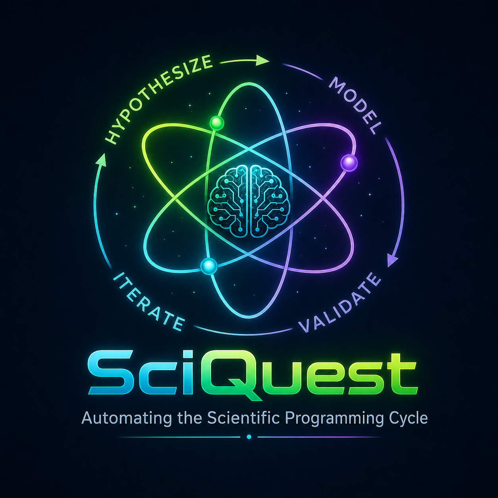

<p align="center">
  
</p>

# SciQuest

SciQuest is an open-source, domain-agnostic Python framework for agent-operable autonomous research programs. A user creates a long-running Quest; SciQuest provides deterministic infrastructure for hypothesis tracking, Jupyter experiment execution, validation, reporting, dashboards, and scientific journaling while an external agent such as Hermes, Codex, Claude, or another local/open agent supplies scientific reasoning and creativity.

Core architecture principle:

- SciQuest Core = deterministic infrastructure
- Agent = scientific reasoning, synthesis, hypothesis evolution, data work, debugging, and interpretation

SciQuest intentionally does not hard-code any research domain, dataset, model architecture, or proprietary concept.

## Current v1 capabilities

- Quest initialization with natural-language prompts
- Structured YAML/Markdown research state
- User idea/data injection via `sciquest continue`
- Agent handoff for one iteration via `run-next --start-agent`
- Sequential multi-iteration mode via `run-loop`
- Lock-aware state management to avoid concurrent runs
- Jupyter notebook scaffold and nbclient execution wrapper
- Validation metric normalization and aggregate scoring
- Logic checks for scientific/artifact consistency
- Research journal entries
- Technical diagrams and experiment artifacts
- Static dashboard with experiment tabs, embedded SVG plots/diagrams, validation metric definitions, MathJax equations, and logo-based styling
- Terminal SCI-QUEST banner for `new` and `continue`

## Install

From the repo:

```bash
cd /home/edtaylor/code/sciquest
python3 -m venv .venv
. .venv/bin/activate
pip install -e '.[test]'
```

For normal use after setup:

```bash
cd /home/edtaylor/code/sciquest
. .venv/bin/activate
sciquest --help
```

Run tests:

```bash
pytest tests -q
```

## Quick start

Create a quest interactively:

```bash
sciquest new
```

Create a quest and immediately hand it to an external agent:

```bash
sciquest new --start-agent --agent-command "hermes chat -q"
```

Set a default agent command:

```bash
export SCIQUEST_AGENT_COMMAND="hermes chat -q"
sciquest new --start-agent
```

Run the next iteration for an existing quest:

```bash
sciquest run-next --quest <quest_slug> --start-agent --agent-command "hermes chat -q"
```

Run up to three more iterations sequentially:

```bash
sciquest run-loop --quest <quest_slug> --start-agent --agent-command "hermes chat -q"
```

Override the loop count:

```bash
sciquest run-loop --quest <quest_slug> --max-iterations 10 --start-agent --agent-command "hermes chat -q"
```

Build the dashboard:

```bash
sciquest dashboard --quest <quest_slug>
```

Open the dashboard:

```bash
xdg-open quests/<quest_slug>/reports/dashboard/index.html
```

Every command accepts `--root PATH`; quests are stored under `PATH/quests/`.

## CLI commands

```bash
sciquest new
sciquest continue --quest <quest_slug> --idea "new idea" --data "new data note"
sciquest list
sciquest status --quest <quest_slug>
sciquest run-next --quest <quest_slug>
sciquest run-next --quest <quest_slug> --start-agent --agent-command "hermes chat -q"
sciquest run-loop --quest <quest_slug> --start-agent --agent-command "hermes chat -q"
sciquest validate --quest <quest_slug> --experiment exp_001
sciquest logic-check --quest <quest_slug> --experiment exp_001
sciquest dashboard --quest <quest_slug>
sciquest journal --quest <quest_slug>
sciquest journal --quest <quest_slug> --append "manual note"
```

Use `--no-splash` with `new` or `continue` to suppress the terminal SCI-QUEST banner.

## New quest flow

`sciquest new` prompts for:

1. Hero Statement
2. Problem Statement
3. Initial Hypothesis, conceptual and observational
4. Subjective Priors, optional
5. Core Data Description, optional
6. Validation Suite, optional
7. Validation weighting preferences, optional natural language
8. Confirmation to start quest

Inputs are stored in structured YAML and Markdown. If no core data is supplied, SciQuest creates `data_manifest.yaml` with `status: missing_user_data`. The agent must infer required data, find or generate a dataset, store it in `data/raw/`, and document schema, meaning, provenance, and limitations.

If no validation suite is supplied, SciQuest marks `validation.yaml` as `agent_required`. The agent must formalize metrics with name, description, direction, weight, and normalization.

## Injecting ideas and data

Use `sciquest continue` to steer a quest before the next iteration:

```bash
sciquest continue \
  --quest <quest_slug> \
  --idea "For the next hypothesis, test capacity censoring and sellout effects." \
  --data "Prefer a benchmark with booking curves, remaining capacity, and observed sellout indicators."
```

Injections are written to:

```text
quests/<quest_slug>/user_injections.yaml
quests/<quest_slug>/journal.md
```

The agent protocol instructs future agents to read the quest files and journal before evolving the next hypothesis.

## Quest layout

```text
quests/
  <quest_slug>/
    quest.yaml
    state.yaml
    hypotheses.yaml
    validation.yaml
    data_manifest.yaml
    journal.md
    AGENTS.md
    user_injections.yaml
    data/
      raw/
      processed/
    experiments/
      exp_001/
        experiment.yaml
        hypothesis.md
        notebook.ipynb
        executed_notebook.ipynb
        experiment_report.md
        validation_results.yaml
        logs/
        artifacts/
          data_generation_script.py
          world_model_coefficients.json
          plots/
            *.svg
          diagrams/
            model_architecture.svg
            validation_technique.svg
    reports/
      dashboard/
        index.html
    artifacts/
      logo.png
    logs/
```

Quest directories are gitignored by default so research artifacts do not accidentally become package source commits.

## Experiment lifecycle

Each iteration follows this intended lifecycle:

1. Agent reads all quest files and AGENTS.md
2. Agent evolves exactly one testable hypothesis
3. Agent creates a new `experiments/exp_NNN/` folder without overwriting history
4. Agent finds, documents, or generates data if required
5. Agent formalizes validation metrics if required
6. Agent writes `experiment.yaml`, `hypothesis.md`, and `notebook.ipynb`
7. Agent creates technical diagrams under `artifacts/diagrams/`
8. Agent executes the notebook
9. If execution fails, agent performs bounded debugging and preserves logs
10. Agent writes metrics to `validation_results.yaml`
11. Agent runs `sciquest validate`
12. Agent runs `sciquest logic-check`
13. Agent writes `experiment_report.md`
14. Agent appends `journal.md`
15. Agent rebuilds the dashboard
16. Agent updates `state.yaml`
17. Agent stops after one iteration unless `run-loop` invoked more

The deterministic scaffold path is still available:

```bash
sciquest run-next --quest <quest_slug> --agent-stub
```

## Multi-iteration loop mode

`run-loop` runs multiple iterations sequentially in the foreground. It does not implement cron, a daemon, or a background scheduler.

Default: 3 iterations.

```bash
sciquest run-loop --quest <quest_slug> --start-agent --agent-command "hermes chat -q"
```

Custom maximum:

```bash
sciquest run-loop --quest <quest_slug> --max-iterations 5 --start-agent --agent-command "hermes chat -q"
```

How it decides whether to trigger the next iteration:

- reads `state.yaml`
- continues only if `quest_status: idle`
- continues only if `lock_id: null`
- stops if status is `running`, `failed`, or locked
- waits for each agent subprocess to return before starting the next one

This prevents concurrent runs from stacking on top of each other.

## Notebook requirements

Experiment notebooks must:

- be Jupyter notebooks
- show dataset preview
- report dataset size before and after transforms/splits
- document preprocessing and features
- define target and inputs clearly
- include docstrings
- generate plots
- save metrics to `validation_results.yaml`
- save artifacts to `artifacts/`
- run in a clean environment
- be split into readable sections: setup, data, preprocessing/features, model/baseline, validation, artifacts, interpretation handoff

SciQuest includes an nbclient-based execution wrapper.

## Validation system

`validation.yaml` metrics use this shape:

```yaml
status: ready
metrics:
  - name: counterfactual_revenue_wape
    description: WAPE of predicted counterfactual revenue.
    direction: minimize
    weight: 0.30
    normalization:
      type: minmax
      min: 0
      max: 0.45
```

Supported directions:

- `maximize`
- `minimize`
- `target`

Supported normalization types:

- `identity`
- `minmax`
- `target`

Aggregate score is the weighted mean of normalized metric scores:

```text
S = sum_i(w_i * s_i) / sum_i(w_i)
```

Common dashboard metric definitions include WAPE, relative WAPE lift, RMSE, rank correlation, and law-of-demand pass rate.

## Logic check

`sciquest logic-check` verifies, as far as deterministic infrastructure can, that:

- a hypothesis exists and can be tested in a notebook
- validation suite exists and has metrics
- data manifest status is visible
- experiment metadata exists
- required directories exist, including `logs/`, `artifacts/plots/`, and `artifacts/diagrams/`
- declared technical diagrams exist
- generated or synthetic datasets preserve a data generation artifact
- notebook artifacts exist and mention required elements
- validation results exist so failures are not silent
- reports separate evidence from speculation
- dashboard metadata fields are present: task type, model architecture, input features, target features, validation technique

Example:

```bash
sciquest logic-check --quest <quest_slug> --experiment exp_003
```

## Dashboard

Build a dynamic static HTML dashboard:

```bash
sciquest dashboard --quest <quest_slug>
```

Output:

```text
quests/<quest_slug>/reports/dashboard/index.html
```

Dashboard features:

- SciQuest logo embedded in the sidebar
- experiment tabs for each `exp_NNN`
- active/latest experiment selected by default
- quest hero and problem statement
- task type
- model architecture explanation
- input and target features
- technical model architecture diagram
- validation technique diagram
- validation metrics and aggregate score
- embedded SVG result graphs
- graph interpretation from `experiment_report.md`
- validation metric definitions with MathJax equations
- Research Model Abstraction diagram and equations
- logo-inspired neon dark theme

Logo handling:

- If `quests/<quest_slug>/artifacts/logo.png` exists, the dashboard embeds it.
- Otherwise, the dashboard tries the local development logo path used in this repo.
- If neither exists, it shows a text fallback.

For a portable quest dashboard, copy the logo into:

```text
quests/<quest_slug>/artifacts/logo.png
```

## State and locking

`state.yaml` tracks:

```yaml
quest_status: idle   # idle, running, failed
current_experiment: null
last_experiment: exp_007
last_score: 0.5146902796181096
best_score: 0.8136382157734285
failures: []
last_updated: "..."
lock_id: null
```

`run-next` acquires a lock before creating an experiment and releases it after success or failure. `run-loop` checks state before each iteration.

## Agent protocol

Every quest gets an `AGENTS.md` file. The protocol instructs agents to:

- read all quest files first
- generate one hypothesis per iteration
- create one experiment folder
- write and execute one notebook
- debug failures with retry limits
- preserve logs and failed experiments
- run validation and logic-check
- create technical diagrams
- write reports and journal entries
- rebuild the dashboard
- update state
- stop after one iteration unless looped externally

SciQuest does not embed a proprietary model or reasoning engine. It launches any configured agent command and passes a self-contained prompt.

## Scheduling

SciQuest does not implement cron. For scheduled operation, use an external scheduler to call:

```bash
sciquest run-next --quest <quest_slug> --start-agent --agent-command "hermes chat -q"
```

or, for bounded bursts:

```bash
sciquest run-loop --quest <quest_slug> --max-iterations 3 --start-agent --agent-command "hermes chat -q"
```

## Development notes

Useful commands:

```bash
pytest tests -q
sciquest --help
sciquest new --no-splash
sciquest dashboard --quest <quest_slug>
```

The package source lives in:

```text
src/sciquest/
```

Tests live in:

```text
tests/
```

## License

MIT
